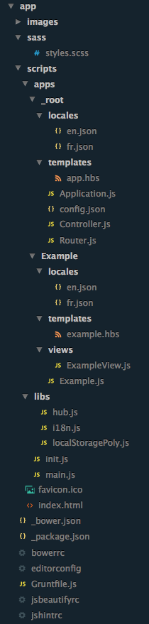
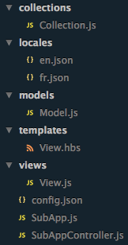

# Generator Maryeo
[Yeoman](http://yeoman.io) generator for scalable Marionette webapps.

Tools requirement
------------------

- [nodejs](http://nodejs.org).
- [Yeoman](http://yeoman.io).
- [GruntCLI](https://github.com/gruntjs/grunt-cli).
- [Bower](https://bower.io).


### Getting Started

If you'd like to get to know Yeoman better and meet some of his friends, 
[Grunt](http://gruntjs.com) and [Bower](http://bower.io), check out the complete 
[Getting Started Guide](https://github.com/yeoman/yeoman/wiki/Getting-Started).

### Overview

The generator comes with [jquery](http://jquery.com), [backbone](http://backbonejs.org/), 
[marionette](http://marionettejs.com/), [bootstrap](http://getbootstrap.com) 
and [font-awesome](http://fortawesome.github.io/Font-Awesome/).

### Installing

install generator-maryeo by running

```shell
npm install -g generator-maryeo
```

### Usage
Scaffold the app in your folder of choice
```shell
yo maryeo
```



### Create a subApp

Once your web app is scaffolded, you can scaffold sub-apps too.
```shell
yo maryeo:subapp [subappname]
```



A sub-app will be created under [scripts/apps/[subappname]](generators/app/templates/app/scripts/apps).

##### Examples

See the [**SubApp Example**](generators/app/templates/app/scripts/apps/Example/Example.js) and the [**SubAppView Example**](generators/app/templates/app/scripts/apps/Example/views/ExampleView.js) to better understand how to integrate your SubApp.

### I18N

You can use the internationalization's helper inside Handlebars templates with `{{i18n 'my_key'}}` or `{{i18n context_variable}}`.

Also, inside your subApp you should listen to `Hub.on('change:lang', action)` to be able to re-render your views each time language changes.

#### Register your strings

You just have to add your entries inside `scripts/apps/[YOUR_SUBAPP]/locales/[lng].json` :

```javascript
//fr.json
{
    "my_key": "Mon texte traduit."
}

//en.json
{
    "my_key": "My translated text."
}
```

You need to register your strings :

```javascript
var en = require( 'json!apps/[YOUR_SUBAPP]/locales/en.json' );
i18n.addLocales( 'en', en );
```
